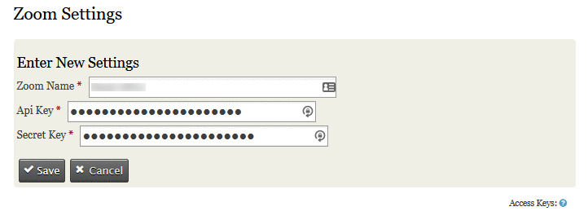
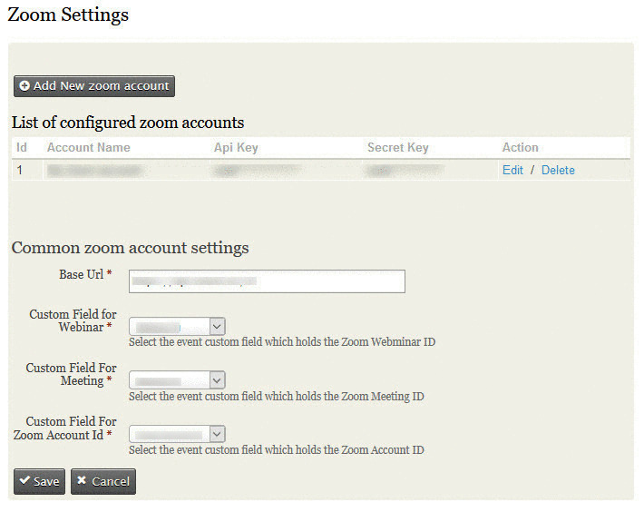

# ncn-civi-zoom
Civirules Conditions/Actions that talk with Zoom developed for NCN.

## Requirements

* PHP v7.0+
* CiviCRM 5.0+
* CiviRules extension

## Installation
* Install the extension in CiviCRM. More details [here](https://docs.civicrm.org/sysadmin/en/latest/customize/extensions/#installing-a-new-extension) about installing extensions in CiviCRM.

## Setup
### Creating a JWT App
* Create a JWT app in your zoom account's [zoom market place](https://marketplace.zoom.us/develop/create) page using the instructions given in [the guide](https://marketplace.zoom.us/docs/guides/build/jwt-app).
* You need to copy the **API Key** and **Client Secret** credentials and paste them in the Zoom settings page.
* Instructions to configure the zoom settings page are given below.

### Configuring Zoom Settings
* After installing the extension navigate  to the zoom settings as **Events >> Zoom Settings**. Where you can add multiple zoom accounts' details such as api_keys and secret_keys and also you can name each of them for your Identification. You can edit/delete any of these settings at anytime.
* You need to add atleast 1 Zoom Account ID to add a zoom event and register the participant(s) for it.
* The Zoom Account ID will be used to indicate that the event belongs to a particular Zoom Account.

* On clicking the **Add New zoom account** button you'll be taken to a page where you need to enter the details of the new zoom account.

* In the same settings page under the 'Commom zoom account settings' section, you need to select the custom fields for storing Webinar ID, Meeting ID and Zoom Account ID.
* You can create custom fields or use the existing ones created for events, to store Webinar ID , Meeting ID and Zoom Account ID.
* Along with that you also need to enter the 'Base url' in the same settings page.

### Configuring an Event
* Once the settings page has been created then you can see the configured zoom account ids list as drop down box just above the Webinar Id field , whenever you Add/Edit an event as below.
* Once you've selected a zoom account and entered a Webinar Id / Meeting Id your webinar/meeting id will be verified with the selected zoom account along with a message next to the text box as below.

## Actions
### Add to Zoom
* Must be paired with an `Event Participant` trigger and the linked conditions shall be the required custom fields such as Webinar Id / Meeting Id and the zoom account Id should not be empty.
* And the action for this rule should be as 'Add Participant to Zoom'.

This action takes the Zoom Webinar/Meeting ID and Zoom account ID from an event where a participant has just been added.
